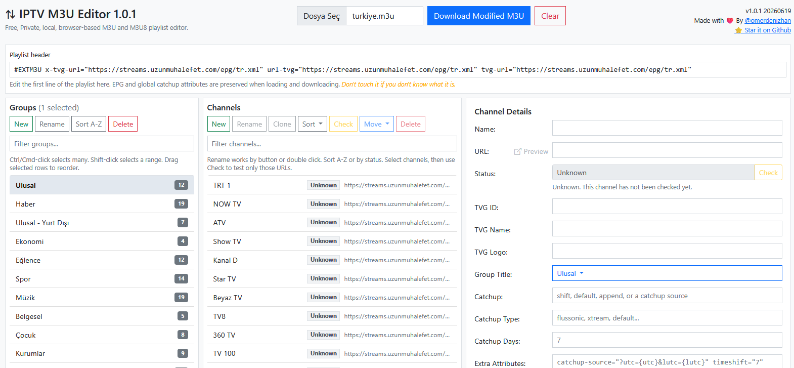

# Awesome M3U Editor 2.0

[](https://github.com/arazgholami/awesome-m3u-editor/blob/main/LICENSE)
[](https://github.com/arazgholami/awesome-m3u-editor/stargazers)

A free, private, browser-based editor for M3U and M3U8 IPTV playlists.

Open a playlist, organize groups and channels, edit channel details, check stream URLs, and download the cleaned playlist. Everything runs in your browser. Your playlist is not uploaded anywhere.

🔗 **Live**: [https://arazgholami.github.io/awesome-m3u-editor/](https://arazgholami.github.io/awesome-m3u-editor/)

## Screenshot


## Main features

- Open `.m3u` and `.m3u8` playlists
- Edit the playlist header, including EPG URLs
- Create, rename, move, sort, and delete groups
- Create, rename, move, sort, and delete channels
- Select one channel, many channels, or a range of channels
- Drag and drop groups and channels
- Filter groups and channels
- Move selected channels to another group
- Edit channel name, URL, TVG fields, logo, group, catchup fields, and extra attributes
- Preserve unknown provider attributes instead of deleting them
- Preview channel URLs
- Check selected channels only
- Queue selected channels and check them 5 at a time
- Show channel status such as `Queued`, `Checking`, `200`, `403`, `404`, `CORS`, `Blocked`, `Bad URL`, `Unsupported`, and `No URL`
- Sort channels A-Z or by status
- Save progress in local browser storage
- Download the edited playlist as a new `.m3u` file

## Sample playlists

```txt
# All TV channels grouped by category
https://iptv-org.github.io/iptv/index.category.m3u

# All TV channels grouped by language
https://iptv-org.github.io/iptv/index.language.m3u

# All TV channels grouped by country
https://iptv-org.github.io/iptv/index.country.m3u
```

## How to use

1. Open the live demo or run `index.html` locally.
2. Choose your `.m3u` or `.m3u8` file.
3. Edit groups, channels, URLs, and metadata.
4. Select channels and click **Check** to test only those channels.
5. Use **Sort** to sort channels A-Z or by status.
6. Click **Download Modified M3U** when you are done.

## Run locally

```bash
git clone https://github.com/arazgholami/awesome-m3u-editor.git
cd awesome-m3u-editor
```

Then open `index.html` in your browser.

## Privacy

Awesome M3U Editor works locally in your browser. Your playlist is not sent to a server.

## Notes about status checking

Browser-based checking has limits. Some IPTV servers block browser status checks with CORS. When that happens, the app shows `CORS` instead of guessing whether the stream is alive or dead.

## License

MIT License. See [LICENSE](LICENSE) for details.

---

Made with ❤️ by [@arazgholami](https://github.com/arazgholami) | [Star on GitHub](https://github.com/arazgholami/awesome-m3u-editor)
